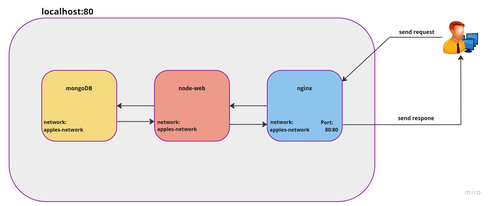

# How many apples do you have?

This project launches a website that displays how many apples are in my DB? That's a great question, although the real task in here is the use of containers.

> To execute the server:
> 1. Pull the repository from GitHub
> 2. Write in the console "./installion.sh"
> 3. Write again in the console "./run-it.sh

After downloading and installing all the dependencies, the web will show how many apples you have in the database.
And so that you can see that it works in any situation, you can change the "init-mongo.js" file, which contains the data for our database, and you can notice that the number of apples displayed on the site changes according to what is entered in the database.

As you can see in our architecture,
The user sends a request to our network that goes through the web server (Nginx) and the network sends the request to the DataBase through the same network, and returns the result of the query through the same network, then the site sends it back to our user through the web server (Nginx)
That is, the way the web server communicates in and out with the client

The only exit of the Internet is through port 80 only and the use of Nginx is for the purpose of increasing the level of security and hiding the architecture from the client, for whom it is conducted against only one server.
